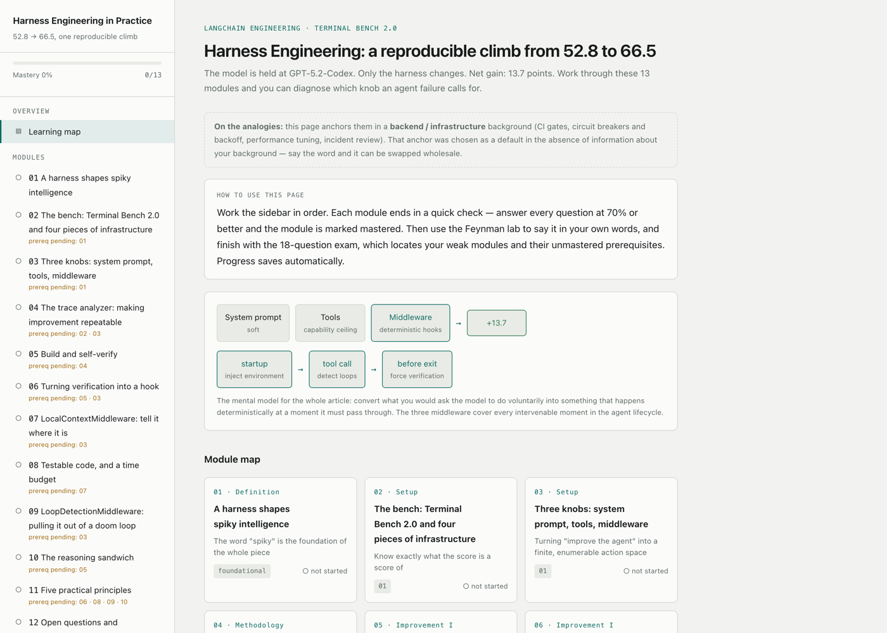
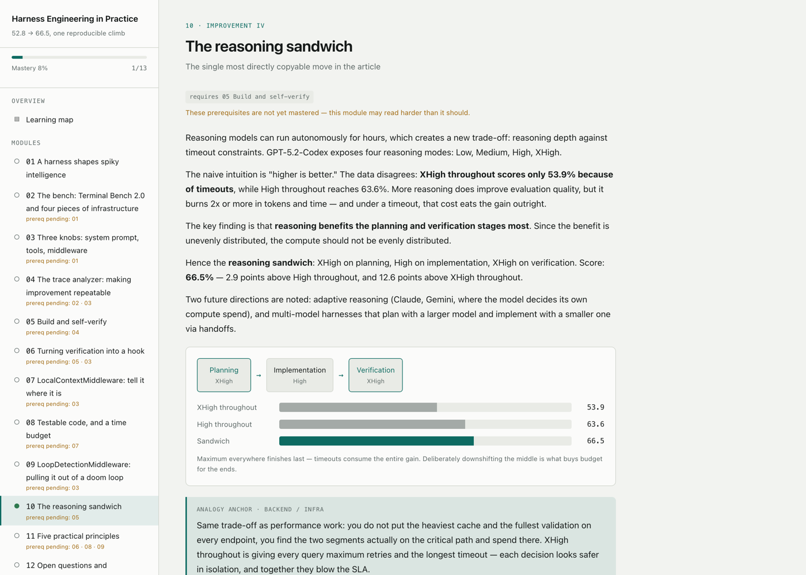
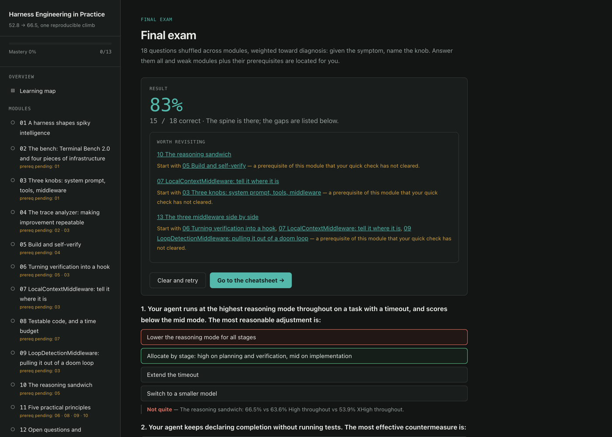
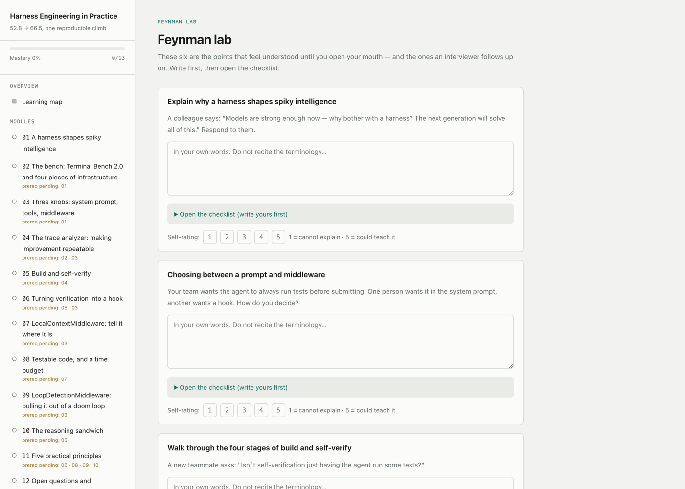
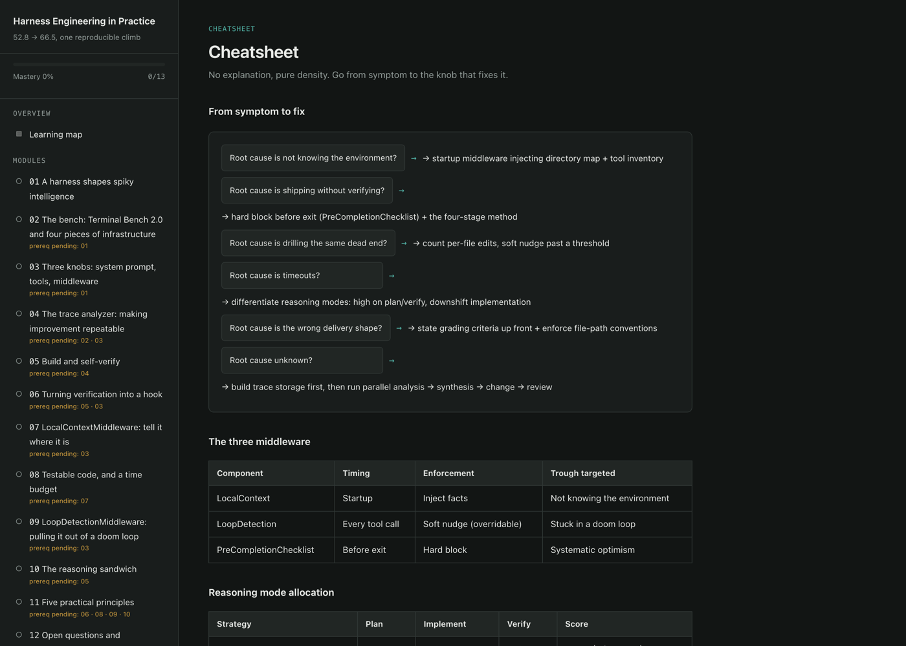

<div align="center">

# Interactive Learning Page

**Turn any source material into a self-contained interactive learning page — not a prettier article.**

[](LICENSE)
[](https://code.claude.com/docs/en/skills)
[](#what-gets-generated)
[](#what-gets-generated)
[](#language-support)

**English** · [简体中文](README.zh-CN.md)

[Why](#why) • [Quick Start](#quick-start) • [What Gets Generated](#what-gets-generated) • [How It Works](#how-it-works) • [Examples](#live-examples) • [FAQ](#faq)

</div>

* * *

## Why

Ask a model to "help me learn this article" and you usually get the article back, reformatted. It reads well, you nod along, and you retain almost nothing — because at no point were you required to *produce* an answer.

This skill treats the request as an **instructional design** problem instead of a formatting one. The HTML is just the delivery mechanism. The actual work is chunking content into modules sized to working memory, forcing an active-recall checkpoint after every concept, mapping which modules depend on which, and making "what have I actually mastered" visible at a glance.

> A page that is only "accurate + pretty" but has no checkpoints is not a learning tool. It's a nicely typeset article.

* * *

## Demo

Generated from [an engineering blog post](https://www.langchain.com/blog/improving-deep-agents-with-harness-engineering) in a single pass — 13 modules, 6 Feynman prompts, an 18-question exam:

[](assets/demo-en-home.png)

<table>
<tr>
<td width="50%"><a href="assets/demo-en-module.png"></a><br><sub><b>Module view</b> — intuition first, then diagram, analogy, misconception callout, comparison table, key takeaways, and a quick check.</sub></td>
<td width="50%"><a href="assets/demo-en-exam.png"></a><br><sub><b>Final exam</b> — scored, with weak modules auto-listed and their unmastered prerequisites chained underneath.</sub></td>
</tr>
<tr>
<td width="50%"><a href="assets/demo-en-feynman.png"></a><br><sub><b>Feynman lab</b> — a situated prompt, a box for your own explanation, and a checklist you only open after writing.</sub></td>
<td width="50%"><a href="assets/demo-en-cheatsheet.png"></a><br><sub><b>Cheatsheet</b> — no prose, pure density. For the five minutes before an interview or exam.</sub></td>
</tr>
</table>

Light and dark are both first-class; the shots above show each. The visual direction is derived from the subject every time rather than reused from a template — [the same skill on a different source](assets/demo-zh-home-alt.png) picks a different one.

* * *

## Quick Start

### 1. Install

**Personal (all projects):**

```bash
git clone https://github.com/ZHAOZHAOLIU/interactive-learning-page.git
cd interactive-learning-page
mkdir -p ~/.claude/skills
cp -r interactive-learning-page ~/.claude/skills/
```

**Project-scoped (this repo only):**

```bash
mkdir -p .claude/skills
cp -r /path/to/interactive-learning-page .claude/skills/
```

Restart Claude Code (or start a new session). Verify it loaded:

```
/interactive-learning-page
```

### 2. Use it

Just describe what you want to learn. The skill triggers on study/learn/review intent — you don't need to name it:

```
Help me learn this article: https://example.com/some-article

Build me a study page for this PDF, I have an interview Thursday

Turn this repo's docs into an onboarding learning page

I need to review these lecture notes before Friday's exam
```

To pin your background — which is what the analogies get anchored to — or the output language:

```
I'm prepping for a systems design interview and my background is
backend infra. Ground the analogies there.

Make an English study page from this Chinese paper, my study group
doesn't read Chinese
```

### 3. Open the result

You get one `.html` file. Double-click it. No build step, no server, no network — it works offline and on any machine you copy it to.

* * *

## What Gets Generated

A single self-contained HTML file with five views, driven by a sidebar:

```
Home / map
├── Module 01 ─┐
├── Module 02  │  10–16 modules, each ending in a quick check
├── ...        │
├── Module N ──┘
├── Feynman Lab      5–7 "explain it out loud" prompts + expert checklists
├── Final Exam       15–20 questions shuffled across all modules
└── Cheatsheet       decision tree, consolidated tables, likely follow-ups
```

**Every module follows the same fixed order** — this ordering *is* the pedagogy:

| # | Section | Purpose |
|---|---------|---------|
| 1 | Eyebrow + title + subtitle | Topic clear in 3 seconds |
| 2 | Intuition-first explanation | *Why this exists*, before any formal definition |
| 3 | Structural diagram | CSS box-and-arrow; reinforces prose, never replaces it |
| 4 | Analogy anchor | Bridged to the learner's actual background |
| 5 | Misconception callout | What people *think* vs. what it means |
| 6 | Comparison table | Becomes the main review artifact later |
| 7 | Key takeaways | 3–5 freshly written bullets |
| 8 | Quick check | 2–3 questions, instant feedback |

**Four interaction mechanisms, all required:**

| Mechanism | What it does |
|-----------|--------------|
| **Per-module quick check** | 2–3 single-choice questions with *plausible* distractors. Mastery = ≥70% correct on a fully attempted module. Feeds the sidebar status icon and global progress bar. |
| **Feynman lab** | Situated prompts ("a colleague asks you X…"), a textarea for your own explanation, a collapsible expert checklist, and a 1–5 self-rating. |
| **Cumulative final exam** | Shuffled across modules, biased toward scenario/application over recall. Every module is guaranteed at least one tagged question. |
| **Weak-area callback** | After the exam, weak modules are listed with jump links — plus any prerequisite that *you* haven't mastered yet, resolved against real per-module status rather than exam co-occurrence. |

**Progress persists.** The page detects its environment and falls back through hosted storage → `localStorage` → in-memory, and tells you honestly in the UI if nothing durable is available.

* * *

## How It Works

```
Ingest source ──▶ Determine output language ──▶ Pick learner anchor
                                                        │
                          ┌─────────────────────────────┘
                          ▼
   Pass 1: full structural outline of the ENTIRE source
                          │
                          ▼
   Pass 2: write each module against its own source section
                          │
                          ▼
   Coverage check ──▶ Build page ──▶ Self-check ──▶ Ship
```

Three parts of this are less obvious than they look, and each exists because of a specific failure:

**Two-pass processing for long sources.** Process a book naively and coverage silently degrades toward the end — by module 12 you're compressing from memory rather than from the source. So the full outline is produced *first*, as an explicit artifact, and each module is written by returning to its actual section. A coverage check then walks the final module list against that outline, so the narrow subsection that's easy to drop doesn't get dropped.

**The prerequisite graph changes behavior, not just decoration.** Each module declares `prereqs: ['m4', 'm7']`. That single source of truth drives the badges on the home cards, a "prereq pending" hint in the sidebar, and — most importantly — the post-exam callback, which resolves against each prerequisite's *own* quick-check mastery. So "start with 04, it feeds into 09" still surfaces even when module 04 wasn't tested this round.

**The anchor context is stated, not silently assumed.** Analogies are only useful if they're grounded in something you already know. When there's no signal about your background and asking isn't an option, the skill picks the adjacent practitioner domain, commits to it, and *says so on the page* — an unstated assumption reads as a wrong analogy, a stated one reads as a configurable default.

* * *

## Supported Sources

| Source | Handling |
|--------|----------|
| URL / web article | Fetched. For multi-page doc sites, the index is read first to find real section links. |
| PDF | Uses a dedicated PDF tool when available; otherwise text-layer extraction, falling back to page images only for scanned documents. |
| docx / pptx / xlsx | Read via a matching tool when available, rather than treated as opaque binary. |
| Plain text / Markdown | Read directly. |
| Code repository | Docs-first scan (README, docs), then a thin slice of key source files. Good for onboarding pages. |
| Video / audio | Asks you for a transcript or `.srt`/`.vtt` — it won't guess at spoken content. Timestamps preserved in the outline. |
| Multiple sources | All ingested before decomposition, then merged into coherent modules — not one module per source. |
| A topic name alone | Asks what to base it on. It won't invent a study page from training-data memory. |

* * *

## Language Support

The page's language is **not** the source's language and isn't hardcoded to any one language — it's whatever you need.

- **Default:** the language you're talking to Claude in. Chatting in Spanish about an English PDF gets you a Spanish page.
- **Explicit override wins:** "give me an English version for my study group."
- **Fully localized:** sidebar labels, buttons, verdict messages, quiz explanations — everything learner-facing, with no leftover template strings in the wrong language.
- **Proper nouns stay put:** protocol names, API parameters, and terms of art practitioners use in their original form are never translated into local-language paraphrase.
- **Script-aware:** font stacks that actually cover the target script (CJK, Thai, Arabic, Devanagari, Cyrillic), Latin-tuned letter-spacing dropped where it looks wrong, and `dir="rtl"` with a mirrored sidebar for RTL languages.

* * *

## Live Examples

Three complete pages generated by this skill from real engineering blog posts. The same source appears in two languages to show what "output language is a choice, not the source's language" means in practice.

| Source | Output | Modules | Page |
|--------|--------|---------|------|
| [LangChain — Improving deep agents with harness engineering](https://www.langchain.com/blog/improving-deep-agents-with-harness-engineering) | English | 13 | [`langchain-harness-engineering.en.html`](examples/langchain-harness-engineering.en.html) |
| [LangChain — Improving deep agents with harness engineering](https://www.langchain.com/blog/improving-deep-agents-with-harness-engineering) | 简体中文 | 13 | [`langchain-harness-engineering.zh-CN.html`](examples/langchain-harness-engineering.zh-CN.html) |
| [Anthropic — Harness design for long-running apps](https://www.anthropic.com/engineering/harness-design-long-running-apps) | 简体中文 | 15 | [`anthropic-harness-design.zh-CN.html`](examples/anthropic-harness-design.zh-CN.html) |

Download any of them and open it in a browser — they're fully functional, including saved progress.

* * *

## Project Structure

```
interactive-learning-page/
├── README.md                         English (this file)
├── README.zh-CN.md                   简体中文
├── LICENSE                           MIT
├── assets/                           Screenshots used in this README
├── examples/                         Three complete generated pages
└── interactive-learning-page/        ← copy this folder into ~/.claude/skills/
    └── SKILL.md
```

* * *

## FAQ

**Does it need an API key, a server, or any dependencies?**
No. The skill is a single Markdown file of instructions, and the output is a single HTML file with inline CSS and JS. Nothing is fetched at page load.

**How long does generation take?**
A normal article (1–3 pieces, or one book chapter) produces 10–16 modules. Long sources take longer because of the mandatory two-pass outline — that's the tradeoff that keeps the back half from thinning out.

**Can I edit the page afterwards, or ask for changes?**
Yes. Ask for a new module, more quiz questions, or a different theme, and the existing file is edited in place — data structures and persistence keys are preserved, so any progress you'd already saved keeps working.

**Why is my progress not saving?**
The page shows a note near the progress bar when no durable storage is available — most often a sandboxed iframe, or a `file://` context where `localStorage` throws. That note is deliberate; the page won't pretend to persist when it can't.

**Can I change the analogies?**
Yes — that's what the anchor line on the home view is for. Tell Claude your actual background and the analogies get re-anchored. They live in one field per module, so it's a bounded edit rather than a regeneration.

**Does it work outside Claude Code?**
The instructions are platform-agnostic about output mechanics — it uses whatever the environment's normal way of creating a file is. It's written and tested for Claude Code.

* * *

## Contributing

Issues and PRs welcome. The most useful contributions are **failure reports**: a source that produced a thin or wrong page, with the link and the language you asked for. That's what the instructions get tuned against.

## License

MIT — see [LICENSE](LICENSE).
