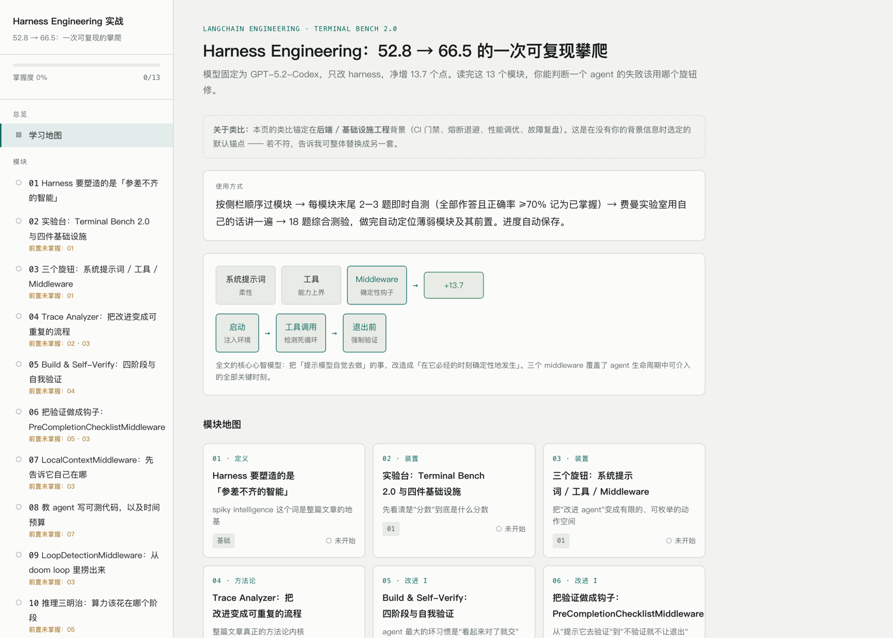
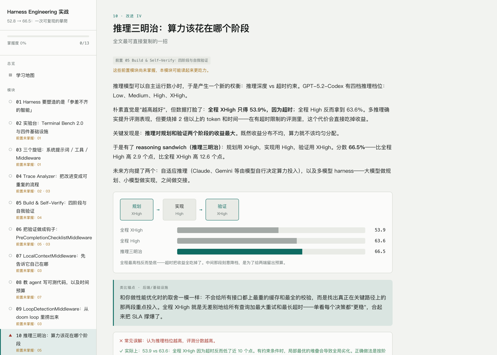
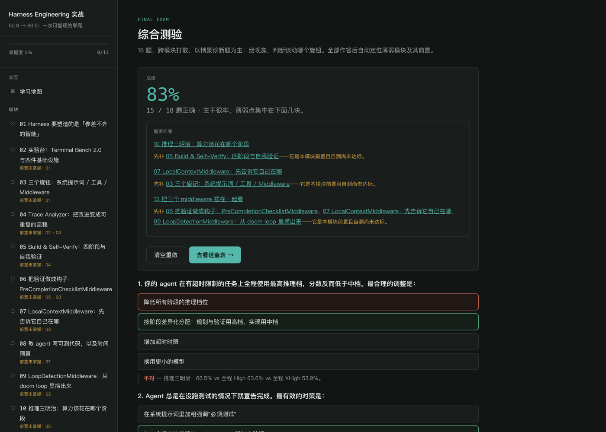
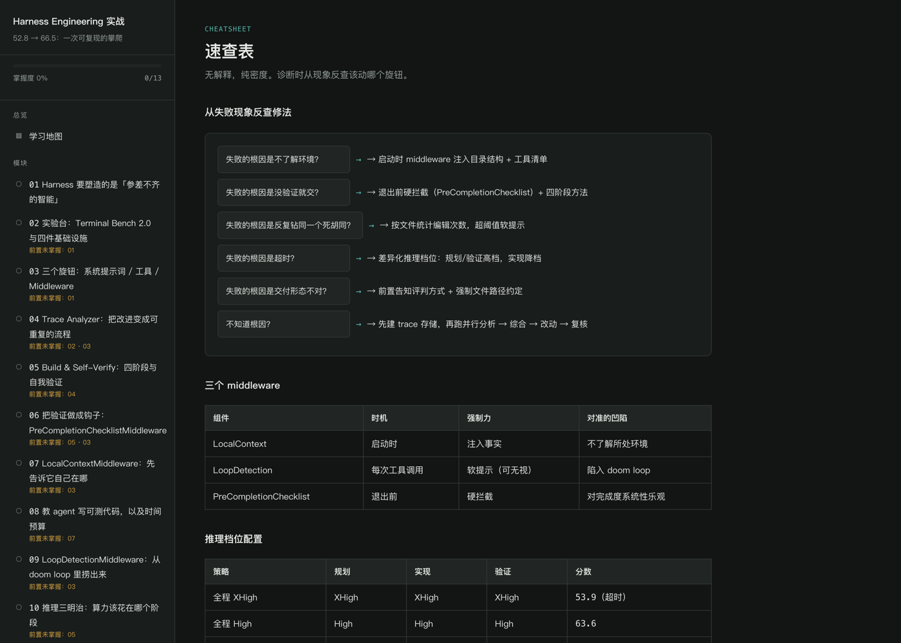
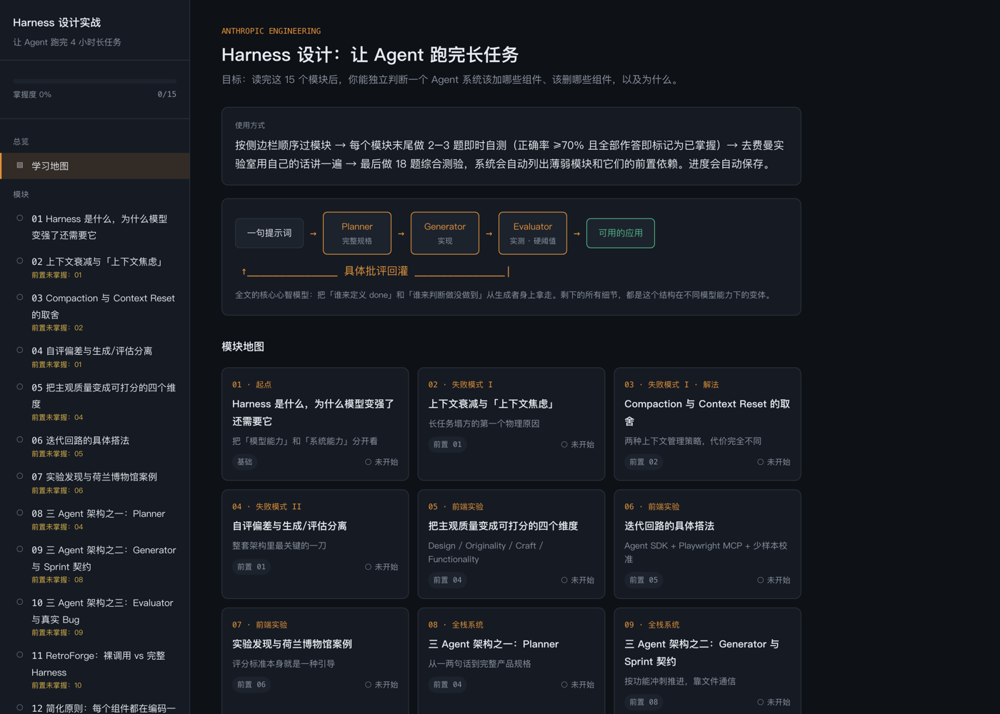

<div align="center">

# Interactive Learning Page

**把任何源材料变成一个可交互的学习页 —— 而不是一篇排版更好看的文章。**

[](LICENSE)
[](https://code.claude.com/docs/en/skills)
[](#生成出来的是什么)
[](#生成出来的是什么)
[](#语言支持)

[English](README.md) · **简体中文**

[为什么](#为什么) • [快速开始](#快速开始) • [生成出来的是什么](#生成出来的是什么) • [工作原理](#工作原理) • [示例](#在线示例) • [常见问题](#常见问题)

</div>

* * *

## 为什么

让模型「帮我学习这篇文章」，你通常拿回来的还是那篇文章，只是重新排了版。读起来很顺，你一路点头，然后几乎什么都没记住 —— 因为整个过程里，你从来没有被要求**产出**过一个答案。

这个 skill 把这件事当作**教学设计**问题来处理，而不是排版问题。HTML 只是投递方式，真正的工作是：把内容切成一次工作记忆能装下的模块、在每个概念之后强制插入一个主动回忆检查点、标出模块之间的依赖关系，并让「我到底掌握了哪些」一眼可见。

> 一个只做到「准确 + 好看」但没有检查点的页面，不是学习工具，它只是一篇排版讲究的文章。

* * *

## 效果图

从[一篇工程博客](https://www.langchain.com/blog/improving-deep-agents-with-harness-engineering)单次生成，中文输出：

[](assets/demo-zh-home.png)

<table>
<tr>
<td width="50%"><a href="assets/demo-zh-module.png"></a><br><sub><b>模块视图</b> —— 直觉先行，然后是结构图、类比锚点、误解提示、对照表、关键要点，最后是即时自测。</sub></td>
<td width="50%"><a href="assets/demo-zh-exam.png"></a><br><sub><b>综合测验</b> —— 出分之外，自动列出薄弱模块，并把你尚未掌握的前置模块挂在下面。</sub></td>
</tr>
<tr>
<td width="50%"><a href="assets/demo-zh-cheatsheet.png"></a><br><sub><b>速查表</b> —— 没有解释性文字，纯密度。为面试或考试前那五分钟准备。</sub></td>
<td width="50%"><a href="assets/demo-zh-home-alt.png"></a><br><sub><b>另一篇源材料</b> —— 视觉方向按主题现推，不套模板。</sub></td>
</tr>
</table>

* * *

## 快速开始

### 1. 安装

**个人级（所有项目可用）：**

```bash
git clone https://github.com/caroliu1024/interactive-learning-page.git
cd interactive-learning-page
mkdir -p ~/.claude/skills
cp -r interactive-learning-page ~/.claude/skills/
```

**项目级（只在当前仓库可用）：**

```bash
mkdir -p .claude/skills
cp -r /path/to/interactive-learning-page .claude/skills/
```

重启 Claude Code（或开一个新会话）。验证是否加载成功：

```
/interactive-learning-page
```

### 2. 使用

直接描述你想学什么就行。这个 skill 会被「学习 / 掌握 / 复习 / 备考」这类意图触发，你不需要点它的名字：

```
帮我学习这篇文章 https://example.com/some-article

给这份 PDF 做个学习页，我周四要面试

把这个仓库的文档做成一个 onboarding 学习页

周五考试，帮我把这几份讲义过一遍
```

想显式指定输出语言或你的背景：

```
用英文给这篇中文论文做学习页 —— 我在准备系统设计面试，
类比请锚定在分布式系统上
```

### 3. 打开结果

你会得到一个 `.html` 文件。双击打开即可。没有构建步骤、不需要起服务、不联网 —— 离线可用，拷到任何机器上都能开。

* * *

## 生成出来的是什么

一个自包含的 HTML 文件，五个视图，侧边栏驱动：

```
学习地图
├── 模块 01 ─┐
├── 模块 02  │  10–16 个模块，每个末尾都有即时自测
├── ...      │
├── 模块 N ──┘
├── 费曼实验室    5–7 个「讲出来」的题目 + 对照清单
├── 综合测验      15–20 题，跨模块打散
└── 速查表        决策树、合并后的对照表、高频追问
```

**每个模块内部的顺序是固定的** —— 这个顺序本身就是教学法：

| # | 部分 | 作用 |
|---|------|------|
| 1 | 眉标 + 标题 + 副标题 | 3 秒内知道这节讲什么 |
| 2 | 直觉先行的解释 | 先讲*为什么存在*，再给正式定义 |
| 3 | 结构图 | CSS 盒箭头；强化正文，不替代正文 |
| 4 | 类比锚点 | 桥接到学习者真实的背景 |
| 5 | 误解提示 | 人们*以为*是什么 vs 实际是什么 |
| 6 | 对照表 | 后期会成为主要的复习资产 |
| 7 | 关键要点 | 3–5 条重新写过的句子，不复制正文 |
| 8 | 即时自测 | 2–3 题，点击即反馈 |

**四种交互机制，缺一不可：**

| 机制 | 做什么 |
|------|--------|
| **模块自测** | 2–3 道单选，干扰项必须*似是而非*。正确率 ≥70% 且全部作答记为掌握，喂给侧栏状态图标和全局进度条。 |
| **费曼实验室** | 情景化提问（「同事问你 X，你怎么解释 Y」）、自己写解释的文本框、可折叠的对照清单、1–5 自评。 |
| **综合测验** | 跨模块打散，偏向情景应用题而非定义回忆。每个模块保证至少有一道被标记的题。 |
| **薄弱回查** | 交卷后列出薄弱模块与跳转链接，并挂上*你自己*尚未掌握的前置模块 —— 依据是真实的模块掌握状态，不是考题共现。 |

**进度会被保存。** 页面会探测所在环境，按 托管存储 → `localStorage` → 内存 三级降级；如果都不可用，会在界面上诚实地告诉你这次的进度不会被保留。

* * *

## 工作原理

```
读取源材料 ──▶ 确定输出语言 ──▶ 选定学习者锚点
                                      │
                ┌─────────────────────┘
                ▼
   第一遍：对整份源材料做完整结构化提纲
                │
                ▼
   第二遍：逐模块回到对应章节写内容
                │
                ▼
   覆盖度检查 ──▶ 构建页面 ──▶ 自检 ──▶ 交付
```

其中有三处比看上去更讲究，每一处都对应一个具体的失败：

**长源材料的两遍法。** 天真地处理一本书，覆盖度会在后半段悄悄劣化 —— 写到第 12 个模块时，你已经在凭印象压缩而不是在读原文了。所以完整提纲必须**先**产出，作为一个显式的中间产物，然后每个模块都回到它真正对应的章节去写。最后再拿模块清单对着提纲走一遍，确保那种「四十页里只占一段」的窄章节没有被悄悄丢掉。

**前置依赖图会改变行为，不只是装饰。** 每个模块声明 `prereqs: ['m4', 'm7']`。这个唯一数据源驱动三件事：首页卡片上的徽章、侧栏的「前置未掌握」提示，以及最重要的 —— 交卷后的回查，它比对的是每个前置模块**自己的**自测掌握状态。所以即使模块 04 这轮压根没被考到，「先补 04，它是 09 的前置」这条提示照样会出现。

**锚点假设是被声明出来的，不是默默设定的。** 类比只有锚在你已经懂的东西上才有用。当没有任何关于你背景的信号、又不适合追问时，skill 会选取相邻的从业领域、明确地承诺一个，并且**在页面上写出来** —— 未声明的假设读起来像「类比错了」，声明了的读起来像「一个可以改的默认值」。

* * *

## 支持的源材料

| 类型 | 处理方式 |
|------|----------|
| 网址 / 网页文章 | 抓取。多页文档站会先读索引页，找到真正的章节链接。 |
| PDF | 有专门的 PDF 工具就用它；否则先抽文本层，只有扫描件才退回逐页图像。 |
| docx / pptx / xlsx | 有对应工具就用工具读，而不是当成不可读的二进制。 |
| 纯文本 / Markdown | 直接读。 |
| 代码仓库 | 文档优先（README、docs），再读关键源文件的一小部分。适合做 onboarding 页。 |
| 视频 / 音频 | 会向你要字幕或 `.srt`/`.vtt`，而不是猜测口播内容。提纲里保留时间戳。 |
| 多份材料 | 全部读完再做拆解，然后合并成连贯的模块 —— 不是一份材料一个模块。 |
| 只给一个主题名 | 会问你要基于什么。不会凭训练记忆编一个学习页出来。 |

* * *

## 语言支持

页面的语言**不等于**源材料的语言，也没有被写死成任何一种语言 —— 它取决于你需要什么。

- **默认**：你和 Claude 对话时用的语言。用西班牙语聊一份英文 PDF，得到的是西班牙语页面。
- **显式指定优先**：「给我出个英文版，我要发给学习小组。」
- **完全本地化**：侧栏文字、按钮、评语、题目解析 —— 所有面向学习者的文本，不会出现语言混杂的残留模板串。
- **专有名词保持原样**：协议名、API 参数、以及从业者本来就用原文的术语，不会被翻译成本地语言的意译。
- **文字系统适配**：字体栈真正覆盖目标文字（CJK、泰文、阿拉伯文、天城文、西里尔文），为拉丁字母调过的字距会在不合适的文字上去掉，RTL 语言会设 `dir="rtl"` 并把侧栏镜像到右侧。

* * *

## 在线示例

三个由本 skill 从真实工程博客生成的完整页面。同一篇源材料出了两种语言，用来说明「输出语言是一个选择，不等于源材料的语言」在实践中是什么意思。

| 源材料 | 输出语言 | 模块数 | 页面 |
|--------|----------|--------|------|
| [LangChain — Improving deep agents with harness engineering](https://www.langchain.com/blog/improving-deep-agents-with-harness-engineering) | 简体中文 | 13 | [`langchain-harness-engineering.zh-CN.html`](examples/langchain-harness-engineering.zh-CN.html) |
| [LangChain — Improving deep agents with harness engineering](https://www.langchain.com/blog/improving-deep-agents-with-harness-engineering) | English | 13 | [`langchain-harness-engineering.en.html`](examples/langchain-harness-engineering.en.html) |
| [Anthropic — Harness design for long-running apps](https://www.anthropic.com/engineering/harness-design-long-running-apps) | 简体中文 | 15 | [`anthropic-harness-design.zh-CN.html`](examples/anthropic-harness-design.zh-CN.html) |

下载任意一个用浏览器打开即可 —— 它们是完全可用的，包括进度保存。

* * *

## 目录结构

```
interactive-learning-page/
├── README.md                         英文（原版）
├── README.zh-CN.md                   简体中文（本文件）
├── LICENSE                           MIT
├── assets/                           README 用到的截图
├── examples/                         三个完整的生成结果
└── interactive-learning-page/        ← 把这个文件夹拷进 ~/.claude/skills/
    └── SKILL.md
```

* * *

## 常见问题

**需要 API key、服务器或任何依赖吗？**
不需要。skill 本身就是一个 Markdown 指令文件，产出是一个内联了 CSS 和 JS 的单 HTML 文件，页面加载时不请求任何外部资源。

**生成要多久？**
一篇常规文章（1–3 篇，或一个章节）会产出 10–16 个模块。长源材料会更久，因为强制要走两遍法 —— 这正是保证后半段不变薄所付的代价。

**生成完还能改吗？**
可以。要求加模块、加题、换配色，都会在原文件上就地编辑 —— 数据结构和存储键保持不变，所以你已经保存的进度在更新后依然有效。

**为什么我的进度没保存？**
当没有可用的持久化存储时，页面会在进度条附近显示提示 —— 最常见的是沙箱 iframe，或者 `file://` 环境下 `localStorage` 直接抛异常。这个提示是刻意保留的：存不了的时候，页面不会假装存上了。

**能改类比吗？**
能 —— 首页那行锚点声明就是为此存在的。告诉 Claude 你真实的背景，类比会被整体重锚。它们在每个模块里只占一个字段，所以这是有界的编辑而不是重新生成。

**在 Claude Code 之外能用吗？**
指令本身对输出机制是平台无关的 —— 用所在环境创建文件的常规方式即可。但它是针对 Claude Code 编写和测试的。

* * *

## 参与贡献

欢迎提 issue 和 PR。最有价值的贡献是**失败案例**：哪份源材料生成出了单薄或错误的页面，附上链接和你要求的输出语言。指令就是靠这些case调优的。

## 许可

MIT —— 见 [LICENSE](LICENSE)。
